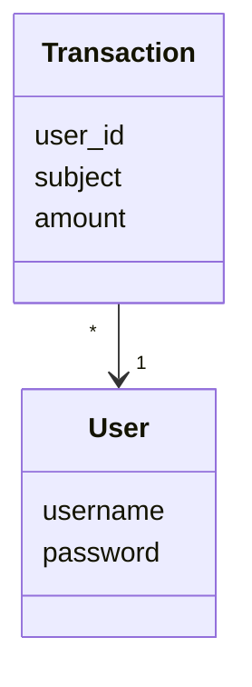
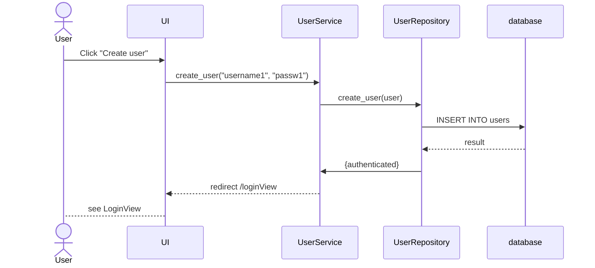

# Arkkitehtuurikuvaus

## Rakenne

## Käyttöliittymä
 
 

## Sovelluslogiikka 

#### Kerroskuvaus

###### Tietomalli, Luokat

Luokat 'User' ja 'Transaction'

###### Database: SQLite3

Tietokanta alustetaan README.md:n mukaisesti.

## Päätoiminnallisuudet

#### Käyttäjätilin luominen

Käyttäjätilin luominen näyttää sekvenssikaaviona tältä. Viimeistä LoginView'hun uudelleenohjausta ei ole vielä toteutettu.

