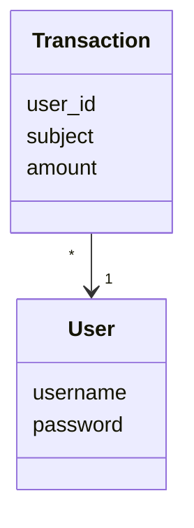
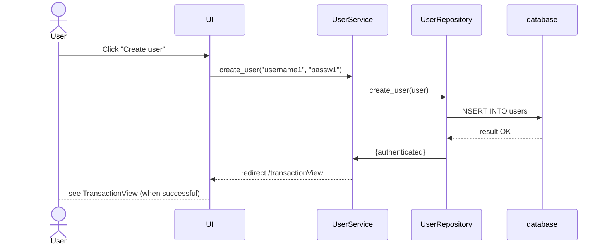
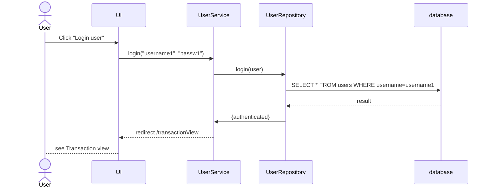
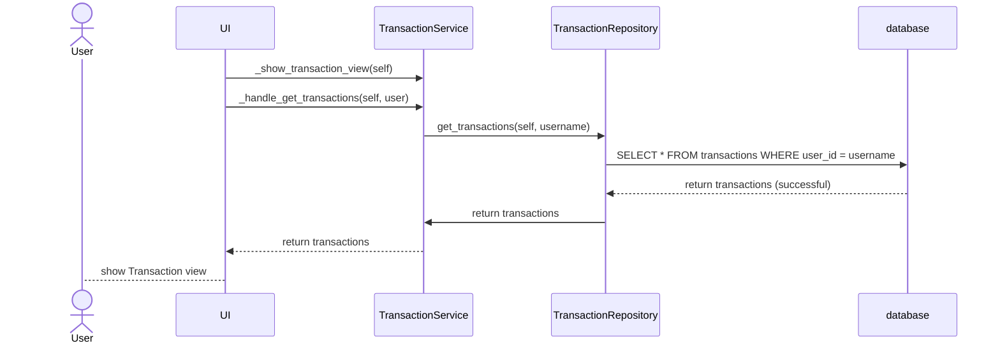

# Arkkitehtuurikuvaus

## Rakenne

Ohjelman rakenne noudattaa kolmikerroksista kerrosarkkitehtuuria ja sen pakkauskaavio on seuraava:

UI sisältää käyttöliitymästä vastaavan koodin, services sisältää sovelluslogiikasta ja repositories tiedon tallennuksesta vastaavan koodin. Kerroskuvauskohdassa kuvataan kerrosten luokat ja sisältö tarkemmin.

## Käyttöliittymä

Käyttöliittymä sisältää kolme eri näkymää: kirjautuminen, käyttäjätilin luominen ja budjettinäkymä.

 
 

Jokaiselle näistä on tehty omat luokat: Login_view.py, create_user_view.py ja transaction_view.py. Käyttöliittymä on eriytetty sovelluslogiikasta ja tallennuslogiikasta.

## Sovelluslogiikka 

Sovelluksen loogisen tietomallin muodostavat käyttäjään ja tuloihin/menoihin jakautuvat luokat, User- ja Transaction-luokat. Myös sovelluslogiikan jako on tehty näiden kahden luokan mukaisesti. 

User service -luokka pitää sisällään käyttäjään liittyvän logiikan, kuten käyttäjätilin luominen ja kirjautuminen. Transaction service -luokka taas huolehtii tulojen ja menojen lisäyksestä budjettiin sekä niiden näyttämisestä käyttäjäkohtaisesti.

Nämä Service-luokat eli sovelluslogiikasta huolehtivat luokat ovat yhteydessä Repository-luokkiin eli luokkiin, jotka huolehtivat tiedon pysyväistalletuksesta.

#### Kerroskuvaus

###### Tietomalli, Luokat

Luokat 'User' ja 'Transaction'

###### Database: SQLite3

Tietokanta alustetaan README.md:n mukaisesti. Repositories-luokat UserRepository ja TransactionRepository tallettavat tietokantaan tiedot. Molempien repositorioiden tallennus tapahtuu SQLite-tietokantaan, jossa on kaksi erillistä tietokantataulua, users ja transactions.

## Päätoiminnallisuudet

Sovelluksen päätoiminnallisuuksia ovat kirjautuminen, käyttäjätilin luominen sekä tulojen ja menojen näyttäminen sekä kirjaus.

### Käyttäjätilin luominen

Käyttäjä luo käyttäjätilin käyttäjätilin luomissivulla syöttämällä käyttäjätunnuksen ja salasanan. Tässä sekvenssikaaviossa kuvataan käyttäjätilin luonti

### Käyttäjän kirjautuminen

Käyttäjä kirjautuu kirjautumissivulla syöttämällä käyttäjätunnuksen ja salasanan. Tässä sekvenssikaaviossa kuvataan kirjautuminen.

### Budjettinäkymän näyttäminen:

Käyttäjä kirjauduttuaan sovellukseen näkee hänen kirjaamansa menot ja tulot sekä niiden summan. 

## Ohjelmaan jääneet heikkoudet

### Käyttöliittymä

Menon tai tulon kirjaamisessa ei näy käyttöliittymässä virhetilannetta, vaikka sovellus ei suostukaan tallentamaan summaa, joka ei ole kokonaisluku tai jos summa tai aihe on tyhjä. 

Tkinterissä ei saisi käyttää grid() ja pack() -metodeita samassa ikkunassa yhtä aikaa, mutta taulukon näyttäminen tässä ajassa ei onnistunut ilman, että molempia on käytetty. Tästä syystä taulukko on väärässä sijainnissa suunnitteluun nähden.