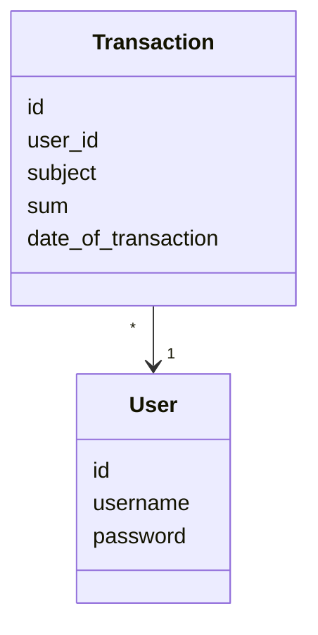
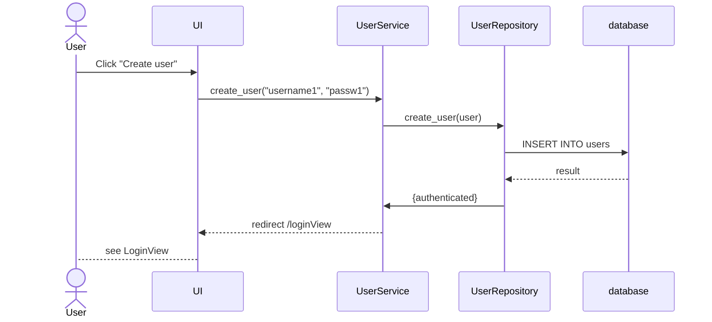

# Arkkitehtuurikuvaus

## Rakenne
- Tähän kuva kerrosarkkitehtuurista

## Käyttöliittymä
- Lisätään, kun valmiimpi 

## Sovelluslogiikka 

#### Kerroskuvaus

###### Tietomalli, Luokat

Luokat 'User' ja 'Transaction'

###### Database: SQLite3

## Päätoiminnallisuudet

#### Käyttäjätilin luominen

Käyttäjätilin luominen näyttää sekvenssikaaviona tältä. Viimeistä LoginView'hun uudelleenohjausta ei ole vielä toteutettu.

