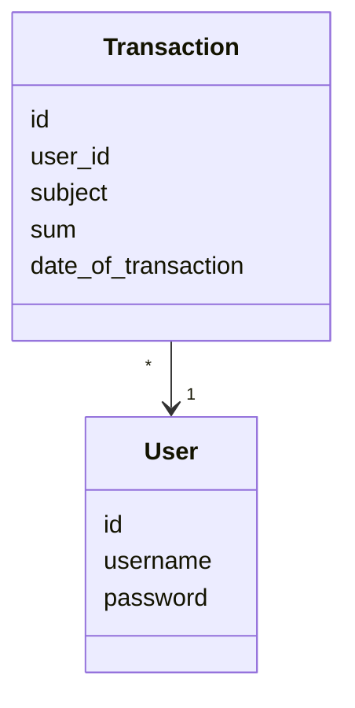

## Class diagram

Class User and Transaction

```mermaid
 classDiagram
      Transaction "*" --> "1" User
      class User{
          id
          username
          password
      }
      class Transaction{
          id
          user_id
          subject
          sum
          date_of_transaction
      }
```