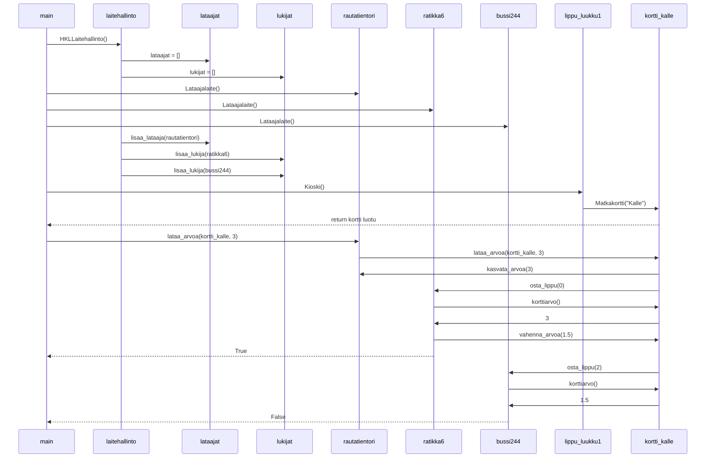

## Sequence diagram

```mermaid
sequenceDiagram
    main->>laitehallinto: HKLLaitehallinto()
    laitehallinto->>lataajat: lataajat = []
    laitehallinto->>lukijat: lukijat = []
    main->>rautatientori: Lataajalaite()
    main->>ratikka6: Lataajalaite()
    main->>bussi244: Lataajalaite()
    laitehallinto->>lataajat: lisaa_lataaja(rautatientori)
    laitehallinto->>lukijat: lisaa_lukija(ratikka6)
    laitehallinto->>lukijat: lisaa_lukija(bussi244)
    main->>lippu_luukku1: Kioski()
    lippu_luukku1->>kortti_kalle: Matkakortti("Kalle")
    kortti_kalle-->>main: return kortti luotu
    main->>rautatientori: lataa_arvoa(kortti_kalle, 3)
    rautatientori->>kortti_kalle: lataa_arvoa(kortti_kalle, 3)
    kortti_kalle->>rautatientori: kasvata_arvoa(3)
    kortti_kalle->>ratikka6: osta_lippu(0)
    ratikka6->>kortti_kalle: korttiarvo()
    kortti_kalle->>ratikka6: 3
    ratikka6->>kortti_kalle: vahenna_arvoa(1.5)
    ratikka6-->>main: True
    kortti_kalle->>bussi244: osta_lippu(2)
    bussi244->>kortti_kalle: korttiarvo()
    kortti_kalle->>bussi244: 1.5
    bussi244-->>main: False
```