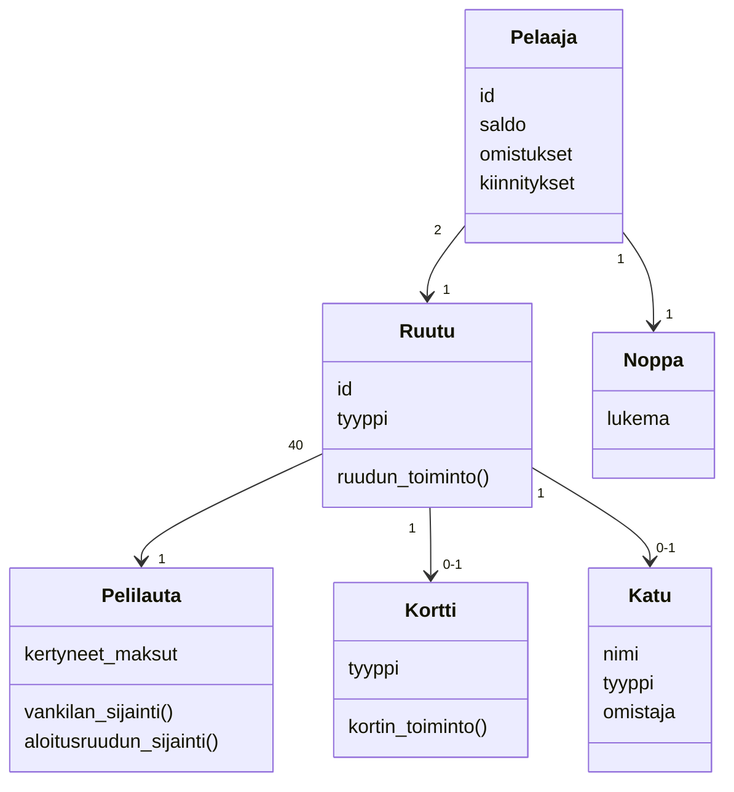

## Sovelluslogiikka

Sovelluksen loogisen tietomallin muodostavat luokat Noppa, Ruutu, Pelaaja, Pelilauta:

```mermaid
 classDiagram
      Pelaaja "2" --> "1" Ruutu
      Ruutu "40" --> "1" Pelilauta
      Pelaaja "1" --> "1" Noppa
      Ruutu "1" --> "0-1" Kortti 
      Ruutu "1" --> "0-1" Katu
      class Noppa{
          lukema
      }
      class Pelaaja{
          id
          saldo
          omistukset
          kiinnitykset
      }
      class Pelilauta{
          kertyneet_maksut
          vankilan_sijainti()
          aloitusruudun_sijainti()
      }
      class Ruutu{
          id 
          tyyppi
          ruudun_toiminto()
      }
      class Kortti{
          tyyppi
          kortin_toiminto()
      }
      class Katu{
          nimi
          tyyppi
          omistaja
      }
```