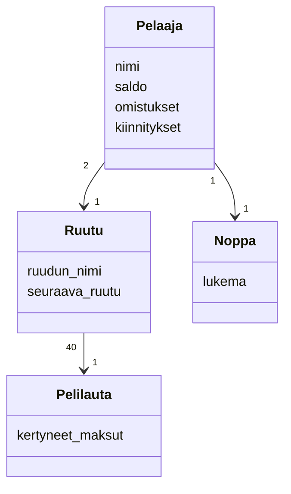

## Sovelluslogiikka

Sovelluksen loogisen tietomallin muodostavat luokat Noppa, Pelaaja, Pelilauta:

```mermaid
 classDiagram
      Pelaaja "2" --> "1" Ruutu
      Ruutu "40" --> "1" Pelilauta
      Pelaaja "1" --> "1" Noppa
      class Noppa{
          lukema
      }
      class Pelaaja{
          nimi
          saldo
          omistukset
          kiinnitykset
      }
      class Pelilauta{
          kertyneet_maksut
      }
      class Ruutu{
          ruudun_nimi
          seuraava_ruutu
      }
```